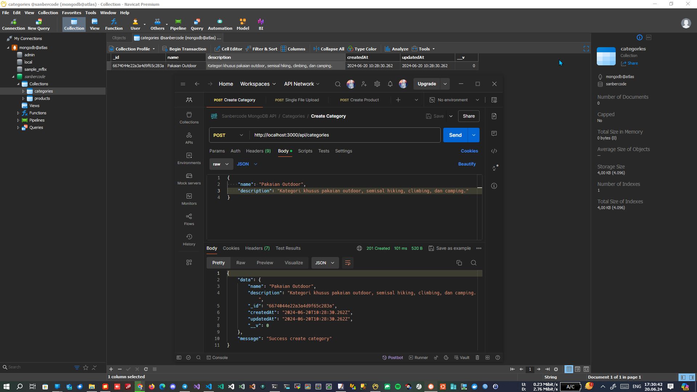

# Tugas 9 Sanbercode MongoDB API - Node.JS Backend

## Muhammad Ridwan Hakim

### Deploy Localhost

```bash
git clone https://github.com/rescenic/nodejs-tugas9.git

cd nodejs-tugas9

npm install

npm run dev
```

### Import Sanbercode MongoDB API.postman_collection.json to Postman

### Screenshots

#### 1. Create Category



#### 2. Upload Image of The Product to Cloudinary


#### 3. Create Product and Insert the newly created categoryId to the body request


